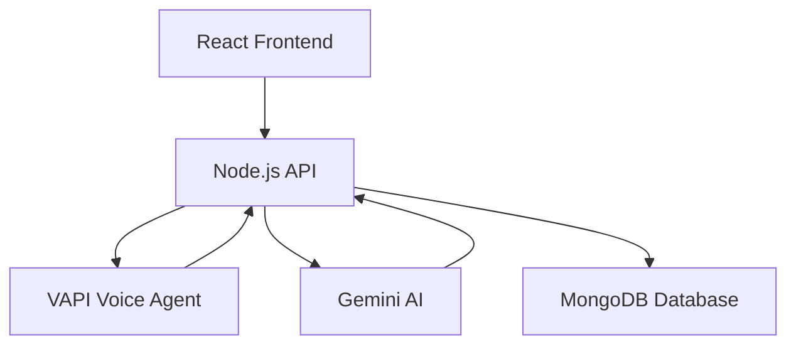
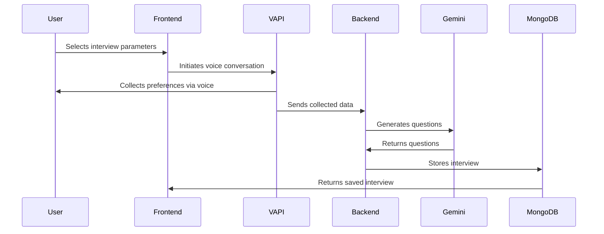
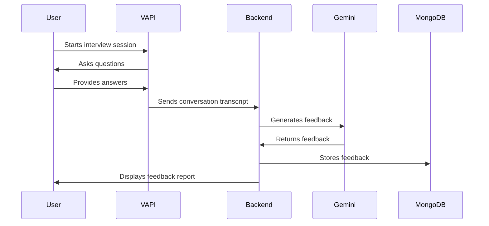
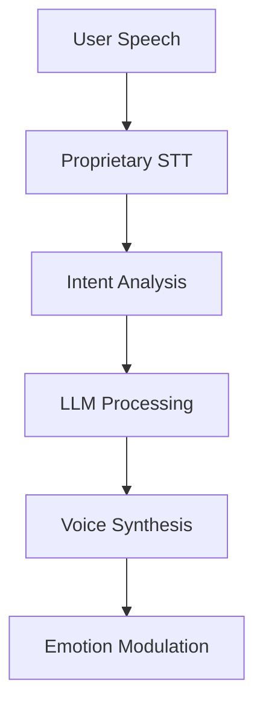
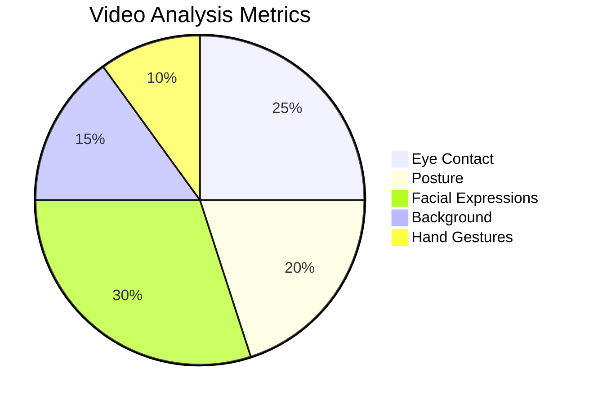

# HireSonic - AI-Powered Interview Preparation Platform

## 🚀 Overview
HireSonic is an AI-powered interview platform that helps candidates practice technical and behavioral interviews with an AI voice agent. Users can create personalized interviews based on role, tech stack, and difficulty level, then receive detailed feedback on their performance.

## ✨ Key Features
- **Personalized Interviews**: Tailor interviews based on role, tech stack, and question types
- **AI Voice Agent**: Natural conversation with VAPI-powered interviewer
- **Comprehensive Feedback**: Detailed analysis of technical knowledge, communication skills, and more
- **Interview History**: Track all past interviews and progress
- **Google OAuth**: Secure authentication with multiple login options

## 🛠 Tech Stack
| Component        | Technology |
|------------------|------------|
| Frontend         | React      |
| Backend          | Node.js    |
| AI Integration   | Gemini API |
| Voice Agent      | VAPI       |
| Database         | MongoDB    |

## 📊 System Architecture


## 🎨 UI Screenshots

### 1. Home Page


### 2. Interview Creation


### 4. Feedback Report


## 🔧 Installation

### Prerequisites
- Node.js (v16+)
- MongoDB
- VAPI account
- Google Cloud API credentials

### Setup Instructions
1. Clone the repository:
```bash
git clone https://github.com/ayush-jha123/HireSonic.git
cd HireSonic
```

2. Install dependencies for both frontend and backend:
```bash
# Frontend
cd client
npm install

# Backend
cd ../server
npm install
```

3. Set up environment variables:
Create `.env` files in both `client` and `server` directories with required credentials.

4. Start the application:
```bash
# In separate terminals
cd server && npm start
cd client && npm start
```

## 🌟 Features in Detail

### Interview Creation Workflow


### Interview Practice Workflow


Here's the complete, polished **Future Scope** section ready for your README.md file, with proper formatting, visualizations, and clear structure:

---

## 🌟 Future Scope & Evolution Roadmap

### 1. **Custom Voice Agent Development**
**Goal**: Replace third-party VAPI with proprietary voice technology  
**Features**:
- 🎙️ **Adaptive Interviewer Personality**  
  - Select between "Friendly", "Technical", or "HR" mode  
  - Dynamic tone adjustment based on user stress levels  
- 🌐 **Multilingual Support**  
  - Initial support for English, Hindi, and Spanish  
  - Accent-agnostic speech recognition  
- ⚡ **Low-Latency Engine**  
  - <500ms response time for natural flow  
  - Offline capability for core functionalities  



### 2. **AI-Powered Coding Arena**
**Components**:
**Key Features**:
- 🧑💻 **Real-time Pair Programming**  
  - Context-aware hints (Ctrl+Space for suggestions)  
  - "Interviewer Mode" that asks clarifying questions  
- 📊 **Code Analysis Dashboard**  
  - Time-to-solution metrics  
  - Efficiency comparison against optimal solutions  

### 3. **Intelligent Practice Modules**
| Module Type | Description | Tech Stack |
|-------------|-------------|------------|
| **DSA Trainer** | Adaptive problem sets with growing difficulty | Gemini API + LeetCode API |
| **System Design Lab** | Interactive architecture diagrams with AI feedback | MermaidJS + Custom LLM |
| **Behavioral Sim** | STAR method evaluation with video analysis | OpenCV + GPT-4 |

### 4. **Video Interview Suite**
**Computer Vision Features**:

**Implementation Roadmap**:
1. Phase 1: Basic webcam recording with replay  
2. Phase 2: Real-time posture alerts  
3. Phase 3: Full emotion recognition  

### 6. **Enterprise Integration**
**For Companies**:
- 🔐 **Custom Question Banks**  
  - Domain-specific question generator  
  - Team collaboration features  
- 📋 **Candidate Benchmarking**  
  - Performance comparison against industry standards  
  - Detailed analytics dashboard  


**Why This Matters**:  
We're building more than an interview tool - this is a *complete career preparation platform* that bridges the gap between theoretical knowledge and real-world interview performance through AI-powered simulations.

---

## 🤝 Contributing
We welcome contributions! Please follow these steps:
1. Fork the repository
2. Create your feature branch (`git checkout -b feature/AmazingFeature`)
3. Commit your changes (`git commit -m 'Add some AmazingFeature'`)
4. Push to the branch (`git push origin feature/AmazingFeature`)
5. Open a Pull Request

## 📄 License
This project is currently unlicensed. Contact the author for usage permissions.

## 📧 Contact
For inquiries or support, contact [your-email@example.com](mailto:kumarayushjha123@gmail.com)
